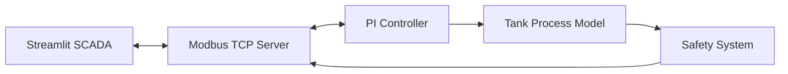
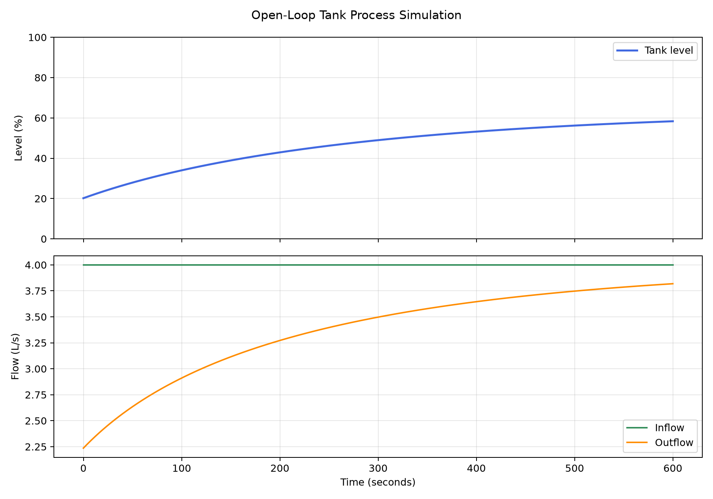
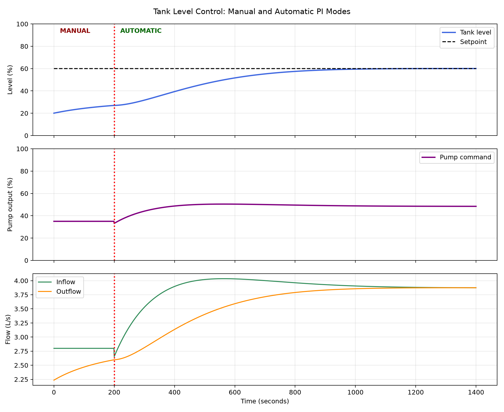
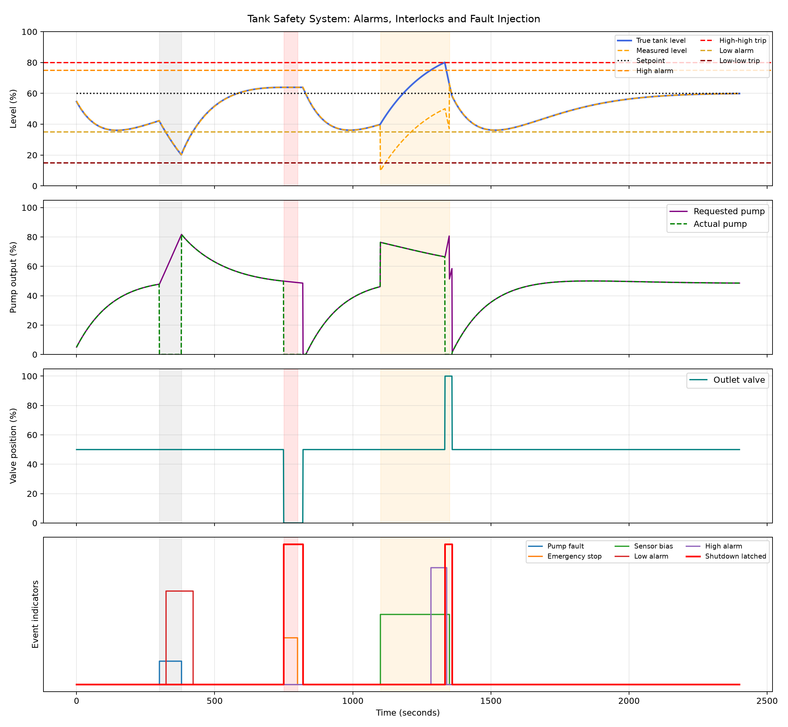
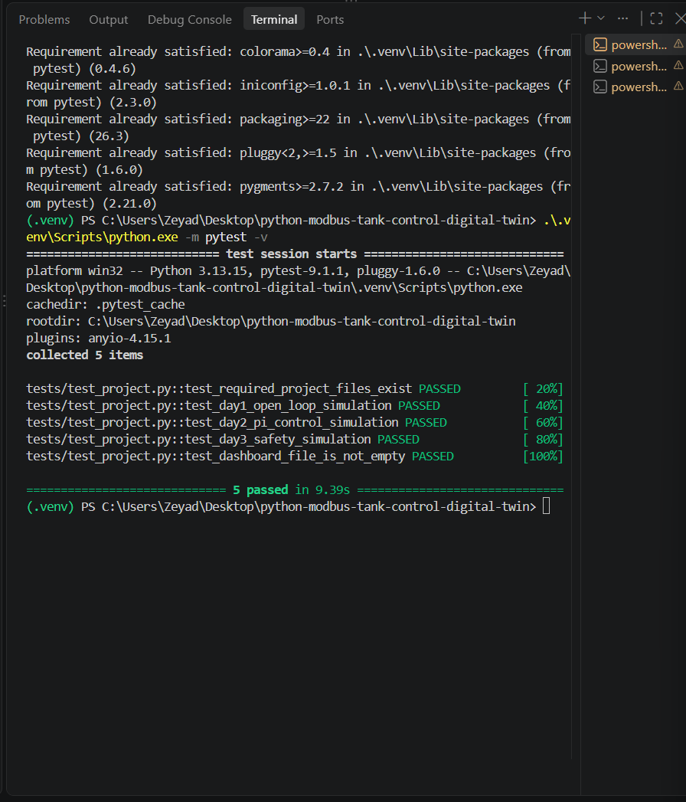

# Modbus TCP Tank-Control Digital Twin

A software-only industrial control and SCADA project developed in Python. The project simulates a liquid tank, applies automatic PI level control, handles alarms and safety interlocks, exchanges process data through Modbus TCP and provides a live Streamlit operator dashboard.

No physical PLC or hardware is required.

## Features

- Dynamic tank-process simulation
- Manual and automatic operating modes
- PI tank-level controller
- Adjustable level setpoint
- Simulated pump and outlet valve
- Low and high-level alarms
- High-high and low-low safety trips
- Pump-fault and sensor-bias injection
- Emergency-stop handling
- Latched shutdown and controlled reset
- Modbus TCP server and test client
- Live Streamlit SCADA dashboard
- CSV process-data logging
- Automated verification using `pytest`

## System Architecture



## Project Structure

```text
python-modbus-tank-control-digital-twin/
├── dashboard/
│   └── app.py
├── docs/
│   ├── requirements.md
│   └── verification-results.md
├── images/
│   ├── day1_tank_response.png
│   ├── day2_pi_control.png
│   ├── day3_safety_response.png
│   ├── day5_scada_dashboard.png
│   └── day6_automated_tests.png
├── logs/
│   ├── day1_plant_simulation.csv
│   ├── day2_pi_control.csv
│   └── day3_safety_simulation.csv
├── src/
│   ├── controller.py
│   ├── day2_control_simulation.py
│   ├── day3_safety_simulation.py
│   ├── modbus_client_test.py
│   ├── modbus_map.py
│   ├── modbus_server.py
│   ├── plant_model.py
│   ├── safety_system.py
│   └── simulation.py
├── tests/
│   └── test_project.py
├── .gitignore
├── README.md
└── requirements.txt
```

## Installation

Clone the repository and enter the project folder:

```powershell
git clone https://github.com/zeyadeldokmak/python-modbus-tank-control-digital-twin.git
cd python-modbus-tank-control-digital-twin
```

Create the Python virtual environment:

```powershell
py -m venv .venv
```

Install the required packages:

```powershell
.\.venv\Scripts\python.exe -m pip install -r requirements.txt
```

## Running the Project

### 1. Start the Modbus TCP server

Open the first VS Code terminal and run:

```powershell
.\.venv\Scripts\python.exe src\modbus_server.py
```

The server runs locally at:

```text
127.0.0.1:5020
```

### 2. Start the SCADA dashboard

Open a second VS Code terminal and run:

```powershell
.\.venv\Scripts\python.exe -m streamlit run dashboard\app.py
```

The dashboard will open in the web browser.

### 3. Run the Modbus client test

With the server still running, use another terminal:

```powershell
.\.venv\Scripts\python.exe src\modbus_client_test.py
```

## Automated Testing

Run all automated project tests with:

```powershell
.\.venv\Scripts\python.exe -m pytest -v
```

Final verification result:

```text
5 passed
```

The tests verify:

- Required project files
- Open-loop tank simulation
- PI level-control simulation
- Safety-system simulation
- Streamlit dashboard implementation

## Results

### Open-Loop Tank Simulation



### PI Level Control



### Safety and Fault Simulation



### Live Modbus SCADA Dashboard


### Automated Test Results



## Verification

The system successfully demonstrated:

- Stable tank-process simulation
- Manual-to-automatic control transfer
- PI setpoint tracking
- Alarm generation
- Safety interlocks
- Emergency-stop operation
- Controlled reset behaviour
- Modbus TCP communication
- Live SCADA monitoring and control
- Automated regression testing

Full verification details are available in [`docs/verification-results.md`](docs/verification-results.md).

## Tools and Technologies

- Python
- Modbus TCP
- Streamlit
- Plotly
- pandas
- pytest
- VS Code
- Git and GitHub

## Project Status

**Complete — all planned simulations, communications, dashboard and automated tests passed.**